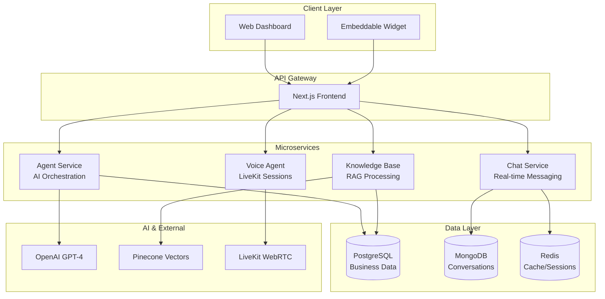

# 🤖 Syntera

**Production conversational AI platform for enterprise deployment.**

> Built by Stephane WAMBA - AI Engineer specializing in scalable conversational systems

## ⚡ Core Features

| Category | Capabilities |
|----------|-------------|
| **Conversations** | Multi-channel (chat, voice, email), context-aware, intelligent routing |
| **AI Engine** | GPT-4 with custom prompts, RAG knowledge bases, workflow automation |
| **Enterprise** | Multi-tenant SaaS, row-level security, production monitoring |
| **Business** | CRM integration, analytics dashboard, API-first design |

## 🏗️ Architecture Overview



## 🎯 Technical Implementation

### Key Decisions
- **TypeScript**: Type safety across the entire stack
- **Microservices**: Independent scaling for different workloads
- **Dual Database**: PostgreSQL for business data, MongoDB for conversations
- **LiveKit**: WebRTC for low-latency voice interactions
- **Pinecone**: Vector search for RAG knowledge retrieval

### Enterprise Features
- **Multi-tenancy**: Row-level security with company isolation
- **Error Handling**: Sentry monitoring across all services
- **Security**: JWT auth, rate limiting, input validation
- **Scalability**: Horizontal scaling with Railway infrastructure

## 🚀 Quick Start

```bash
git clone https://github.com/StephaneWamba/syntera.git
cd syntera

# Configure environment variables
# Create .env.local with required API keys (see docs/DEPLOYMENT.md)
# Required: Supabase, OpenAI, LiveKit, Pinecone

# Install dependencies and run all services
pnpm install
pnpm run dev:all
```

## 📊 Live Demo

**Try the platform**: [https://syntera-tau.vercel.app/](https://syntera-tau.vercel.app/)

- Interactive chat with AI agents
- Voice conversations with LiveKit
- Real-time response generation
- Multi-language support

## 📚 Documentation

| Document | Purpose |
|----------|---------|
| [📖 Architecture](docs/ARCHITECTURE.md) | System design and data flow |
| [🔒 Security](docs/SECURITY.md) | Security measures and compliance |
| [🚀 Deployment](docs/DEPLOYMENT.md) | Production setup guide |
| [🔧 API Reference](docs/API.md) | Complete API documentation |
| [⚙️ Workflows](docs/WORKFLOWS.md) | Automation and triggers |

## 💰 Business Value

- **Cost Reduction**: Automate 60-80% of customer interactions
- **Revenue Growth**: AI-driven lead qualification and sales
- **Scale**: Handle thousands of concurrent conversations
- **Quality**: 24/7 consistent, accurate responses

## 🛠️ Technology Stack

| Layer | Technologies |
|-------|-------------|
| **Frontend** | Next.js 16, React 18, Tailwind CSS, Shadcn/ui |
| **Backend** | Node.js, Express, TypeScript, Socket.io |
| **AI** | OpenAI GPT-4, Pinecone, LiveKit Agents |
| **Database** | PostgreSQL, MongoDB, Redis |
| **Infrastructure** | Railway, Vercel, Docker |

## 📄 License

Licensed under [GNU GPL v3.0](LICENSE) - free for commercial and personal use.

---

**Enterprise Conversational AI - Production-Ready Implementation**